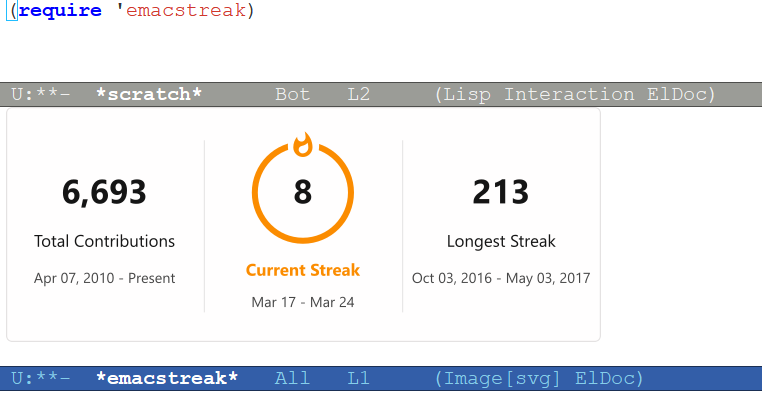

# Emacstreak

GitHub streak stats on Emacs.
This is a feature-less port of [DenverCoder1/github-readme-streak-stats](https://github.com/DenverCoder1/github-readme-streak-stats) in Emacs Lisp.



## Features

- SVG card of the following stats.
  - Total contributions
  - Current streak
  - Longest streak
- Themes as in `github-readme-streak-stats`.
- Written in Emacs Lisp.

### Unimplemented features

- No customizable [options in github-readme-streak-stats](https://github.com/DenverCoder1/github-readme-streak-stats?tab=readme-ov-file#-options) except for `user` and `theme`.

## Setup

### Installation

Clone the repository from GitHub.

```console
$ git clone https://github.com/iquiw/emacstreak.git
```

Add the directory to `load-path` and require `emacstreak`.

```emacs-lisp
(add-to-list 'load-path "/path/to/emacstreak")
(require 'emacstreak)
```

### Configuration

Specify GitHub token in the environment variable `GITHUB_TOKEN` or Emacs
variable `emacstreak-github-token`.

```emacs-lisp
(setopt emacstreak-github-token "github_pat_...")
```

To configure theme, specify theme name in the environment variable
`EMACSTREAK_THEME` or its symbol to `emacstreak-theme` variable.
Refer to [github-readme-streak-stats/docs/themes.md](https://github.com/DenverCoder1/github-readme-streak-stats/blob/main/docs/themes.md) for available themes.

```emacs-lisp
(setopt emacstreak-theme 'nord)
```

## Usage

### Interactive display

<kbd>M-x</kbd> `emacstreak-show-svg` shows SVG card of the specified user
without animation in the popup buffer.

With the prefix-argument, it uses the last queried stats instead of
querying GitHub GraphQL API.
It is useful when trying different theme as the query usually takes some time.

### Interactive save

<kbd>M-x</kbd> `emacstreak-save-svg` saves SVG card of the specified user in
the specified file.

With the prefix-argument, it uses the last queried stats instead of
querying GitHub GraphQL API.
It is useful when trying different theme as the query usually takes some time.

### Batch save

Provided that environment variable `GITHUB_TOKEN` is defined, the following
command outputs SVG card of `<user>` into `<output svg>`.

```console
$ emacs --batch -L . -l emacstreak.el --eval '(emacstreak-save-svg "<user>" "<output svg>")'
```

### GitHub Action

By GitHub Action, SVG card of `<user>` with `<theme>` can be generated and
saved to `<output svg>` like follows.

```yaml
      - uses: actions/checkout@v6
        with:
          repository: iquiw/emacstreak
          path: emacstreak

      - name: Setup Emacs
        uses: purcell/setup-emacs@master
        with:
          version: 30.2

      - name: Generate streak stats card
        run: |
          emacs --batch -L emacstreak -l emacstreak/emacstreak.el --eval '(emacstreak-save-svg "<user>" "<output svg>")'
        env:
          GITHUB_TOKEN: ${{ secrets.GITHUB_TOKEN }}
          EMACSTREAK_THEME: <theme>
```

## Acknowledgments

SVG generation and stats calculation logic are heavily drawn from
[DenverCoder1/github-readme-streak-stats](https://github.com/DenverCoder1/github-readme-streak-stats), though not the same.
